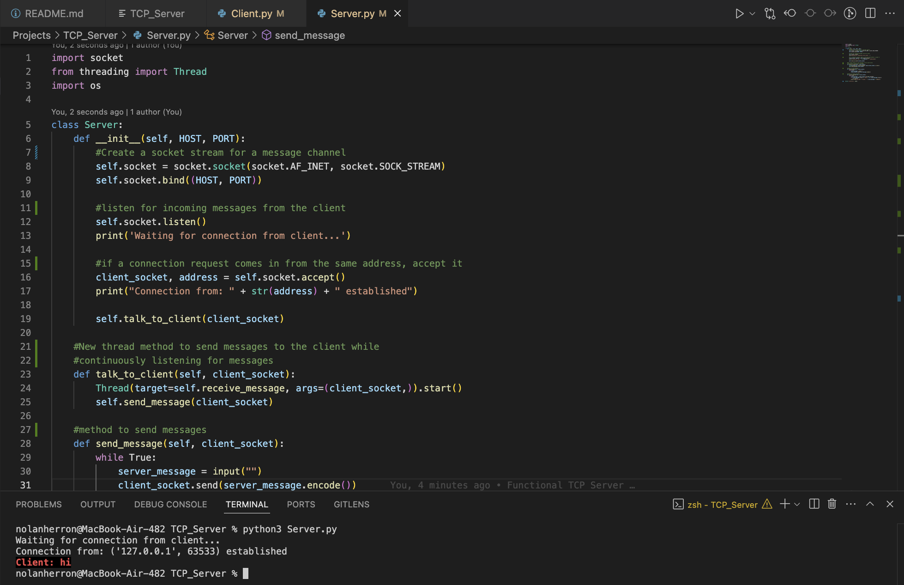
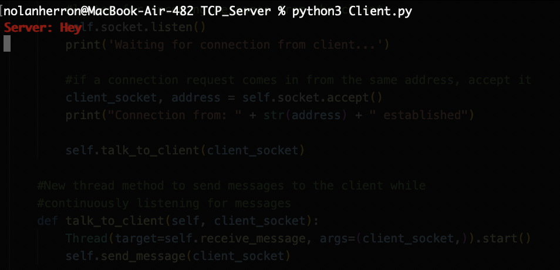

# TCP Server

A TCP server created to experiment with sockets and how sending messages over a server works.

## Server View

## Client View

## Issues Encountered
- Accidentally left servers running between test runs.  
  - Fix: listed all ports in use on my device and killed the processes, allowing the server to be rerun.

## To Run
- Navigate to the directory of the server.py and client.py files.
- Run the server first, then the client. You are then able to communicate between the two.
- Send "bye" on either server or client to end the connection.